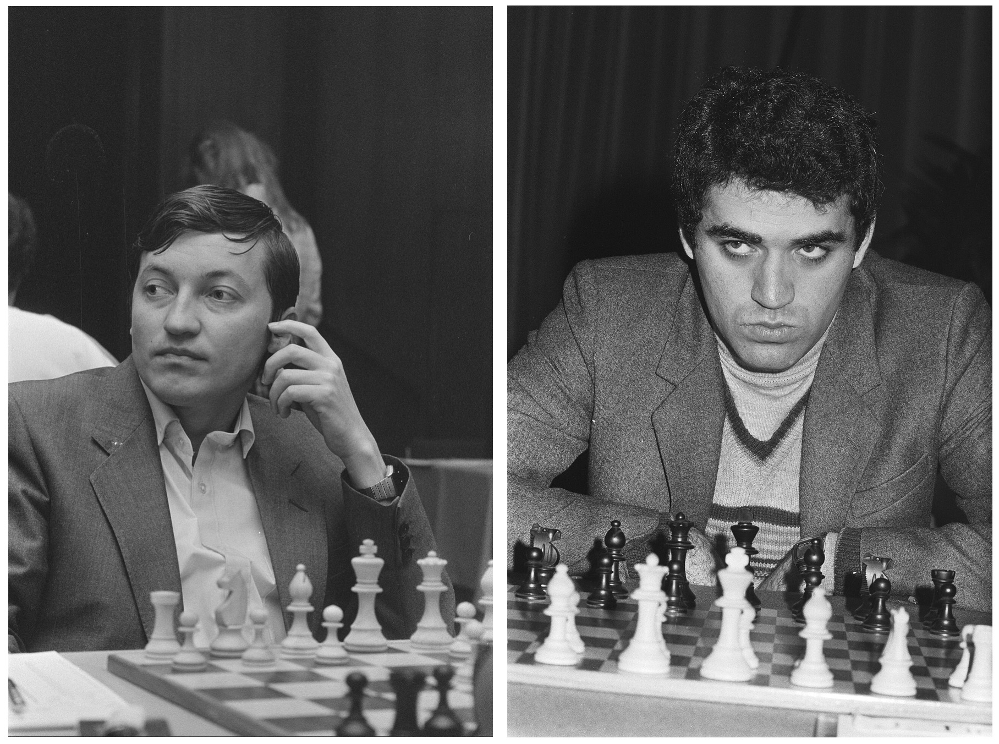
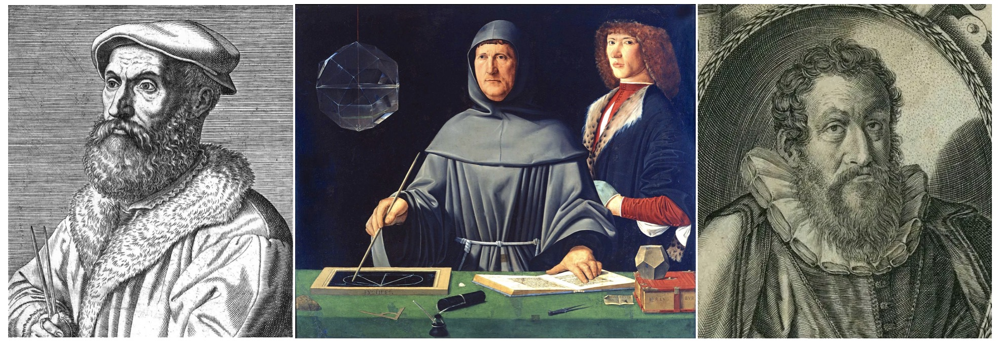
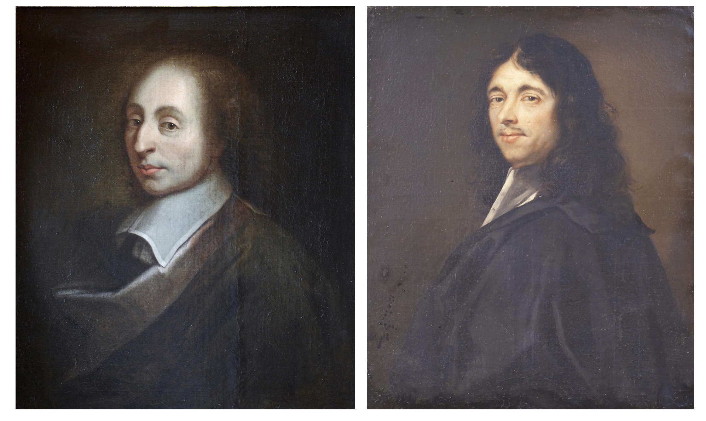
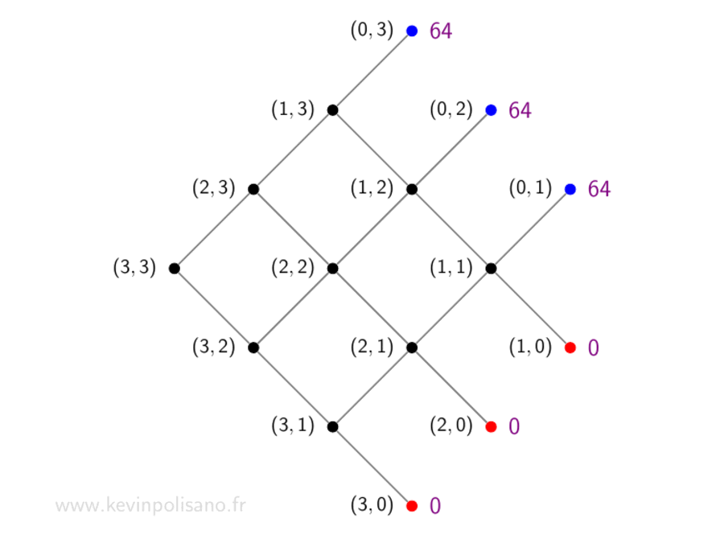
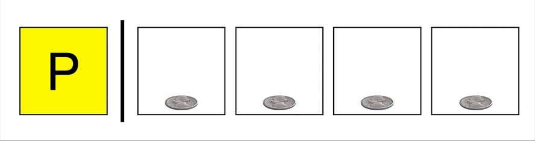
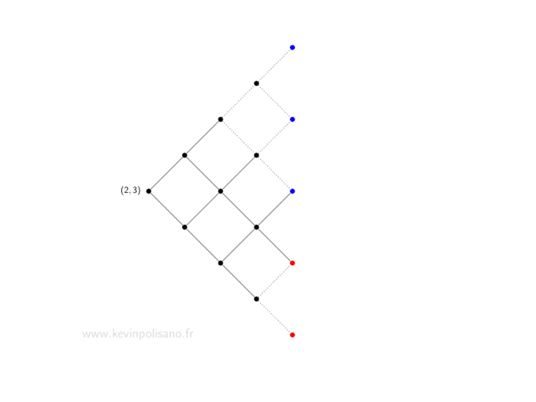
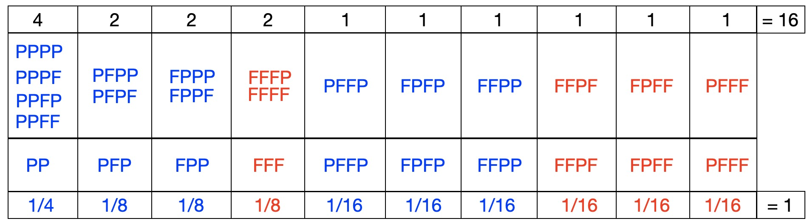
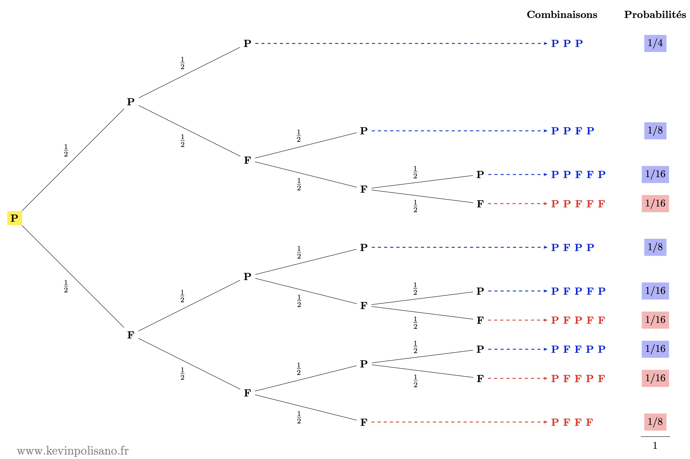

_Cet article a été écrit dans le cadre de la [Semaine des mathématiques 2026](https://www.education.gouv.fr/la-semaine-des-mathematiques-465828)  sur le thème **"Égalités"**, et propose d'aborder les principes de **justice** et **d'équité** sous l'angle des mathématiques._

# Un championnat du monde des échecs interrompu

En 1984, le monde des échecs assiste à un duel d'anthologie entre Anatoli Karpov, champion en titre, et le jeune prodige Garry Kasparov. Le match est atypique : il ne se joue pas en un nombre fixé de parties, mais jusqu’à ce que l’un des joueurs atteigne six victoires. Les nulles n'étant pas comptabilisées. Karpov mène rapidement 4-0 après seulement 9 parties, puis 5-0 après la 27 ème. Il est à un point de la victoire.  Kasparov s'accroche, et finit par marquer un point à  la 32ème partie. S'en suit une longue série de nulles, puis, contre toute attente, Kasparov renverse la vapeur et remporte deux parties consécutives. Après 48 parties  — un record — le score est de 5 victoires à 3 pour Karpov (avec 40 nulles au total !).

 

La tension extrême, et après plus de 5 mois d'affrontement, l'épuisement physique se fait ressentir (Karpov a perdu 10 kg depuis le début du championnat). La FIDE décide d’interrompre le match sans déclarer de vainqueur, pour des raisons officiellement liées à la santé des joueurs, mais probablement aussi pour des raisons politiques...
La récompense s'élevait à 1,9 million de francs suisses. Cependant le match n'a pas été mené à terme. Une question naturelle se pose alors : comment répartir les gains d’un match interrompu ? Mathématiquement, cette question est loin d’être anodine : elle renvoie à un problème vieux de plusieurs siècles, connu sous le nom de problème des partis, au sens de la juste répartition, et dont la solution requiert un partage équitable.

# Le problème des partis

Luca Pacioli, moine franciscain et ami de Léonard de Vinci, expose dès 1494 le problème des partis dans un traité d’arithmétique, à travers l’exemple suivant :

> Une brigade joue à la paume : il faut 60 pour gagner, chaque coup vaut 10. L'enjeu est de 10 ducats. Un incident survient qui force les soldats à interrompre la partie commencée, alors que le premier camp a gagné 50 et le second 20. On demande quelle part de l'enjeu revient à chaque camp...

- Une première idée consisterait à attribuer toute la mise à l’équipe en tête. Mais une telle règle paraît peu équitable : si, par exemple, il fallait atteindre 1000 points pour gagner, donner l’intégralité de l’enjeu à une équipe n’ayant marqué que 50 points serait difficilement justifiable.

- Pacioli propose alors de répartir la mise proportionnellement aux points déjà marqués. Sur un total de 70 points, le premier camp reçoit $\frac{50}{70}=\frac{5}{7}$ de la mise, soit environ 7,14 ducats, et le second $\frac{2}{7}$, soit 2,86 ducats.

Cette solution ne convainc pas Niccolò Tartaglia, qui écrit en 1556 :

> Sa règle ne me paraît ni bonne, ni belle, parce que s'il arrive qu'un parti ait 10 et l'autre rien, et qu'on procédât selon sa règle, le premier devrait tirer tout et le second rien; ce serait tout à fait déraisonnable que pour 10, il doive tirer tout.

En effet le total des points étant de 10, les proportions seraient respectivement de $\frac{10}{10}=1$ et $\frac{0}{10}=0$, ce qui revient à appliquer le premier critère du tout-ou-rien, et donc à attribuer toute la mise au joueur en tête, ce qui n’est guère satisfaisant.

- Tartaglia propose une autre idée : faire dépendre l’écart de gain de l’écart de points. Ici, l’écart est de 30 points, soit la moitié des 60 nécessaires pour gagner. Il suggère donc que l’écart de gain soit la moitié de la mise, soit 5 ducats. Le premier reçoit alors 7,5 ducats et le second 2,5.

- Forestani propose en 1603 de tenir compte de la durée maximale du jeu. Le jeu dure au plus 11 coups (scénario 60 contre 50). Ici, 7 coups ont déjà été joués, il en reste donc 4, qu’il propose de partager équitablement. Le premier reçoit ainsi $\frac{5+2}{11}$ de la mise (soit 6,36 ducats) et le second $\frac{2+2}{11}$ (soit 3,64 ducats).

- En 1539, Cardan  plaide  pour une répartition de l'enjeu selon les points qu'il reste à marquer. Le premier n’a plus qu’un point à obtenir, contre quatre pour le second. En utilisant des progressions arithmétiques (1 d’un côté, $1+2+3+4=10$ de l’autre), il propose une répartition en 
$\frac{10}{11}$ et $\frac{1}{11}$, soit environ 9,1 ducats pour le premier et 0,9 pour le second.

Tous ces savants italiens — parmi lesquels on peut aussi citer Calandri, Peverone ou Pagani — avaient des "opinions diverses" sur le problème des partis. Comme le résume Tartaglia :

> La résolution d’une telle question est davantage d’ordre judiciaire que rationnel et, de quelque manière qu’on veuille la résoudre, on y trouvera sujet à litiges.

# La correspondance entre Pascal et Fermat

En 1654, Antoine Gombaud, connu sous le nom de chevalier de Méré, soumit le problème à Blaise Pascal, qui entama alors une correspondance avec Pierre de Fermat. De cette discussion entre ces deux géants des mathématiques  émergèrent non seulement une solution rigoureuse et satisfaisante, mais aussi les premières idées qui allaient donner naissance à la théorie des probabilités.

Leur intuition fondamentale est la suivante : le partage de la mise ne doit pas dépendre du déroulement passé de la partie, mais des différentes façons dont elle aurait pu se poursuivre. Autrement dit, ce qui compte n’est pas le nombre de manches déjà remportées, mais le nombre de manches qu’il reste à gagner, une idée que Cardan avait déjà pressentie. Il ne faut donc plus regarder vers le passé, mais se projeter vers le futur.

## Illustration avec le jeu de pile ou face

Pascal et Fermat lancent successivement une pièce : si la pièce tombe sur pile (P), Pascal marque un point, si la pièce tombe sur face (F), c’est Fermat qui marque un point. Le premier à atteindre trois points a gagné. Au début du jeu, les deux adversaires misent une somme égale d’argent, disons 32€, et le vainqueur récupère l’ensemble de l’argent mis en jeu, soit 64€. 

Supposons que le jeu s’interrompe avant la fin. Comment les joueurs doivent-ils se répartir les mises de façon juste, c’est-à-dire, suivant les mots de Pascal, « proportionnellement à ce qu’ils sont en droit d’espérer de la fortune » ?

Notons $(p,f)$ le nombre de manches qu'il reste à gagner respectivement à Pascal et Fermat pour remporter la victoire, et $E(p,f)$ le montant que Pascal doit recevoir en cas d’interruption du jeu à ce stade.

## La solution de Pascal

La méthode de Pascal repose sur un raisonnement étape par étape : à chaque manche possible, il évalue la situation et remonte progressivement le cours de la partie. C’est un raisonnement par récurrence rétrograde, où l’on répète le même calcul en partant de cas terminaux, comme une égalité entre les joueurs, pour revenir vers le présent au moment de l'interruption. Pascal propose ainsi un algorithme simple de résolution du problème des partis :

Cas terminaux. Si les deux joueurs ont chacun deux points, ils sont tous deux à un point de la victoire, soit dans la situation $(1,1)$ qui est évidente : la partie se jouera sur un dernier lancer de pièce équilibrée. Chacun a donc une chance sur deux de gagner, et il est juste que chacun récupère la moitié de la mise, soit 32€. Considérons maintenant le cas où Pascal a deux points et Fermat  un point, alors on est dans la situation $(1,2)$ car Pascal est à 1 point de la victoire et Fermat à 2 points. À la prochaine manche :

- si Pascal gagne, il remporte toute la mise (64€) ;
- si Fermat gagne, les deux joueurs se retrouvent à égalité, et on se ramène au cas précédent où chacun a alors droit à 32€.

Ainsi, Pascal est sûr d’obtenir au moins 32€. Pour les 32 restants, il a une chance sur deux de les gagner. Il peut donc en réclamer la moitié, soit 16€. Au total, Pascal doit recevoir 48€, et Fermat 16€.

Cas intermédiaires. Pascal procède pas à pas. Il imagine que l’on joue une manche de plus, puis que l’on sait déjà comment partager équitablement les gains dans les deux cas possibles (selon qui gagne cette manche). Comme chaque joueur a une chance sur deux de gagner la manche suivante, il suffit de prendre la moyenne de ces deux répartitions : $$\color{violet} E(p,f)=\frac{E(p−1,f)+E(p,f−1)}{2}$$ Autrement dit, la valeur d’une position est la moyenne des valeurs des positions suivantes. Ainsi, en connaissant les cas simples (où le jeu est presque terminé), on peut remonter progressivement pour déterminer la solution dans les situations plus complexes. En résumé l’argument de Pascal consiste à remonter dans le passé depuis les situations hypothétiques où l’un des deux joueurs a remporté le jeu.

Dans le cas où la partie aurait été interrompue après un seul lancer tombé sur pile, où il manque donc deux parties à gagner pour Pascal pour Fermat, on en conclut que Pascal doit recevoir $\color{violet}E(2, 3)=44$ euros et Fermat 16€.

## La solution de Fermat

L’idée de Fermat est complètement différente, elle consiste à transformer le problème en une situation de "hasards égaux". Pour cela, il imagine que l’on joue un nombre fixe de manches, même si la partie est déjà gagnée avant la fin (les manches en trop sont sans effet).
Par exemple, s’il manque $p=2$ points à Pascal et $f=3$ à Fermat, il considère $n=p+f-1=4$ manches au total. On peut alors voir la poursuite du jeu, initialement débuté par un pile (en jaune ci-dessous), comme un lancer de 4 pièces :

- si Pascal obtient au moins 2 piles, il gagne ;
- sinon, c’est Fermat qui gagne.

Toutes les issues étant équiprobables, il suffit de  compter parmi les 16 combinaisons possibles lesquelles sont favorables à Pascal, c'est-à-dire parmi tous ces "chemins" dans le graphe ci-dessous lesquels aboutissent à un noeud bleu symbolisant une victoire de Pascal. 

On dénombre ainsi 11 cas favorables à Pascal sur 16, donc il gagne avec probabilité $\color{blue}\frac{11}{16}$ et empoche $$\color{violet} E(2,3)=64 \times {\color{blue} \frac{11}{16}} = 44$$ euros comme déjà calculé par la méthode de Pascal.

Plus généralement, s’il manque $p$ points à Pascal et $f$ à Fermat, on considère $n=p+f−1$ manches où :

- Pascal gagne s’il obtient au moins $p$ succès ;
- sinon, c'est Fermat gagne.

Il suffit alors de compter ces cas : obtenir au moins $p$ piles parmi $n$ lancer revient à faire la somme du nombre de cas $\binom{n}{p}$ où  précisément $p$ pièces sont tombées sur pile, puis du nombre de cas $\binom{n}{p+1}$ où $p + 1$ pièces sont tombées sur pile, etc jusqu'à $\binom{n}{n}$ où les $n$ pièces sont tombées sur pile. Finalement, nous voyons que la probabilité de victoire de Pascal est le quotient de cette somme $$S(p,n) = \binom{n}{p} + \binom{n}{p+1} + \dotsc + \binom{n}{n}$$ par le nombre total de possibilités à savoir $2^{p+f−1}$. 

Les coefficients binomiaux $\binom{n}{k}$, appelés aussi combinaisons, représentent le nombre de façons de sélectionner $k$ objets parmi une collection de $n$ objets distincts. Puisque l'on a la relation ${n \choose k} + {n \choose k+1} = {n+1 \choose k+1}$ et ${n \choose 0}=1$, les coefficients binomiaux se calculent pas à pas et forment le triangle de Pascal (qui n'est pas sans rappeler la méthode par récurrence exposée précédemment). 

Ainsi $S(p,n)$ se lit comme la somme des termes de $p$ à $n$ dans la $n$-ième ligne du triangle. En l'occurrence pour $p=2$ et $n=4$ on obtient  en lisant la dernière ligne du triangle : $$S(2,4)=6+4+1=11$$ et on retrouve ainsi la probabilité $\color{blue}\frac{S(2,4)}{2^4} = \frac{11}{16}$.

Ainsi, à l’inverse de Pascal qui suit le déroulement du jeu pas à pas, Fermat adopte une approche globale : il imagine toutes les suites possibles de manches restantes, en les mettant sur un pied d’égalité, sans tenir compte de l’ordre réel du jeu. Il suppose même que l’on continue à jouer après qu’un vainqueur est déjà connu, afin de considérer tous les cas possibles.

Cette idée a été critiquée par Gilles de Roberval : en pratique, une fois le jeu gagné, on s’arrête, et les manches supplémentaires n’ont pas lieu d'être. Il peut sembler en effet étrange de continuer à lancer la pièce alors que la partie est déjà terminée. En réalité, on peut se limiter aux 10 issues possibles du jeu répertoriées dans le tableau ci-dessous : 

6 issues sont favorables à Pascal et 4 issues sont favorables à Fermat.
Cependant, ces issues ne sont pas toutes équiprobables : plus une suite est longue, moins elle est probable. Une suite de 2 lancers a une probabilité de 1/4, une suite de 3 lancers 1/8, et une suite de 4 lancers 
1/16. En additionnant les probabilités des cas favorables à Pascal, on retrouve qu’il gagne avec une probabilité de 11/16 et son gain associé :

$$  \color{violet} E(2,3) = 64 \times \left( {\color{blue}\frac{1}{4}}+{\color{blue} \frac{2}{8}}+{\color{blue}\frac{3}{16}} \right) = 64 \times {\color{blue} \frac{11}{16}} = 44 $$
On peut visualiser cela avec un arbre de probabilités : 

à chaque lancer, pile ou face a une probabilité 1/2, et la probabilité d’un chemin s’obtient en multipliant celles des branches. C’est d’ailleurs exactement ainsi qu’un élève de Terminale résoudrait aujourd’hui ce problème.

## Comparaison des deux approches

Fermat raisonne donc à partir de situations que l’on peut qualifier de « fictives ». Blaise Pascal en est parfaitement conscient, mais il en défend la pertinence : ces manches feintes n’altèrent en rien le résultat final. Elles permettent simplement de mettre toutes les issues sur un pied d’égalité et de simplifier le calcul. Comme le souligne Pierre de Fermat lui-même : « cette fiction d’étendre le jeu à un certain nombre de parties, ne sert qu’à faciliter la règle, et (suivant mon sentiment) à rendre tous les hasards égaux ». Il précise encore que « l’extension à un certain nombre de parties n’est autre chose que la réduction de diverses fractions à un même dénominateur » et conclut, dans un esprit de conciliation à l’égard de Pascal : « Voilà en peu de mots tout le mystère, qui nous remettra sans doute en bonne intelligence, puisque nous ne cherchons l’un et l’autre que la raison et la vérité ».

L’un des grands intérêts de ce problème, tel qu’il apparaît dans la correspondance entre Pascal et Fermat, est précisément la différence de leurs approches. Bien qu’elles reposent sur des idées très distinctes, elles conduisent au même résultat, ce qui inspire à Pascal cette formule célèbre : « je vois bien que la vérité est la même à Toulouse et à Paris ». En termes modernes, on dirait que Fermat construit un espace de probabilités adapté, où la question se ramène à un simple problème de dénombrement. De son côté, Pascal envisage le jeu comme une forme de contrat entre les joueurs et cherche à déterminer ce que chacun peut légitimement revendiquer sur la mise. Ce faisant, il introduit, de manière encore implicite, la notion d’espérance mathématique, qui sera ensuite formalisée par Christian Huygens.

# Retour au jeu de paume et au championnat du monde des échecs

## Jeu de paume

Reprenons l'énoncé :

> Une brigade joue à la paume : il faut 60 pour gagner, chaque coup vaut 10. L’enjeu est de 10 ducats. Un incident survient qui force les soldats à interrompre la partie commencée, alors que le premier camp a gagné 50 et le second 20. On demande quelle part de l’enjeu revient à chaque camp…

Le premier camp mène donc 5 à 2 : il ne lui manque plus qu’un point pour gagner, contre quatre pour son adversaire. On se trouve ainsi dans la situation $(1,4)$. En appliquant la méthode de Pierre de Fermat avec $p=1$ et $n=4$, on somme les coefficients de la 4ème ligne du triangle de Pascal $$S(1,4)=4+6+4+1=15$$ que l'on divise par $2^4=16$. Le premier camp remporte donc :
$$ \color{violet} E(1,4) = 10 \times {\color{blue} \frac{15}{16}}=9,375$$

On peut comparer ce résultat avec les différentes méthodes proposées au fil du temps :

| **Méthode** | **Premier camp** | **Second camp** |
|:-------- |:--------:| :--------:|
| Tout-ou-rien    | 10   | 0    |
| Pacioli    | 7,14   | 2,86   |
| Tartaglia    | 7,5   | 2,5   |
| Forestani    | 6,36   | 3,64   |
| Cardan    | 9,1   | 0,9   |
| Pascal--Fermat    | 9,375   | 0,625   |

## Match Karpov vs. Kasparov

Le score est de 5-3 en faveur de Karpov. Il ne lui manque plus qu’une victoire pour remporter le match, tandis que Kasparov doit encore en gagner trois. On est donc dans la situation $(1,3)$. En appliquant la formule de Fermat avec $p=1$ et $n=3$, on additionne cette fois tous les coefficients de la 3ème ligne du triangle de Pascal $$S(1,3)=3+3+1=7$$ que l'on divise par $2^3=8$. La probabilité de victoire de Karpov est donc de $\frac{7}{8}$, soit **87,5% de chance de remporter le match**, avec un gain associé de $\frac{7}{8}\times 1 900 000=$ **1 662 500 francs suisses**, et donc de **237 500 francs suisses** pour Kasparov.

**Limites du modèle**

Comme pour le jeu de paume, ce calcul repose sur une hypothèse forte : chaque partie est assimilée à un événement aléatoire, avec une probabilité de $\frac{1}{2}$ pour chaque joueur. Autrement dit, on suppose que les joueurs sont de niveau égal et que le passé n’influence pas le futur. Or, dans un match réel d’échecs, cette hypothèse est discutable. Les résultats dépendent du niveau des joueurs, de leur état de forme, et de facteurs psychologiques. Après 48 parties, Karpov était visiblement épuisé, tandis que Kasparov venait d’enchaîner deux victoires et semblait en pleine remontée. Il est donc plausible que la probabilité pour Karpov de gagner une partie soit devenue inférieure à $\frac{1}{2}$[^1]. 

Supposons par exemple que cette probabilité tombe à $q=\frac{1}{3}$. Dans ce cas, la probabilité que Kasparov gagne le match devient $1-(1-q)^3$ soit environ 28,7 %, contre 71,3 % pour Karpov. Les gains théoriques deviennent alors 545 300 francs suisses pour Kasparov et 1 354 700 francs suisses pour Karpov. Kasparov lui-même estimait d’ailleurs ses chances entre 25 % et 30 %.

[^1]: Dans le modèle de Pascal et Fermat, un joueur menant 5 à 3 dans un match en 6 manches gagnantes (comme dans l’exemple du match Karpov-Kasparov 1984) a les mêmes chances de gagner qu’un joueur menant 25 à 23 (score comptabilisant les nulles) dans un match joué jusqu’à 26 points. Pourtant après 48 parties l'information est beaucoup plus fiable sur le niveau relatif des joueurs qu’après seulement 8 parties. Contrairement au modèle de Pascal–Fermat le passé contient de l’information statistique sur les joueurs. L'hypothèse où chaque manche future est indépendante et a la même probabilité n'est valable que pour les jeux de pur hasard (dés, pièce équilibrée, etc) ou si on suppose les joueurs parfaitement équilibrés. Dans un cadre bayésien, le score passé permet d’estimer la probabilité de victoire future. Et si l’on tient compte de l’ordre des parties, on peut aller encore plus loin : les résultats récents — comme la remontée finale de Kasparov — suggèrent que ces probabilités évoluent au cours du temps. Le jeu n’est alors plus un simple tirage aléatoire, mais un processus dynamique que l'on peut également modéliser avec des mathématiques plus sophistiquées.

**Et dans la réalité ?**

Officiellement, le vainqueur devait recevoir les deux tiers de la dotation, et le perdant un tiers. Cette répartition a vraisemblablement été conservée après l’interruption, soit environ 1 266 667 francs suisses pour Karpov et 633 333 francs suisses pour Kasparov — une répartition finalement assez proche des estimations issues de ce modèle simplifié.

Comme quoi, les mathématiques permettent de « régler ses comptes »... en 1654 comme en 1984, et encore aujourd’hui !

