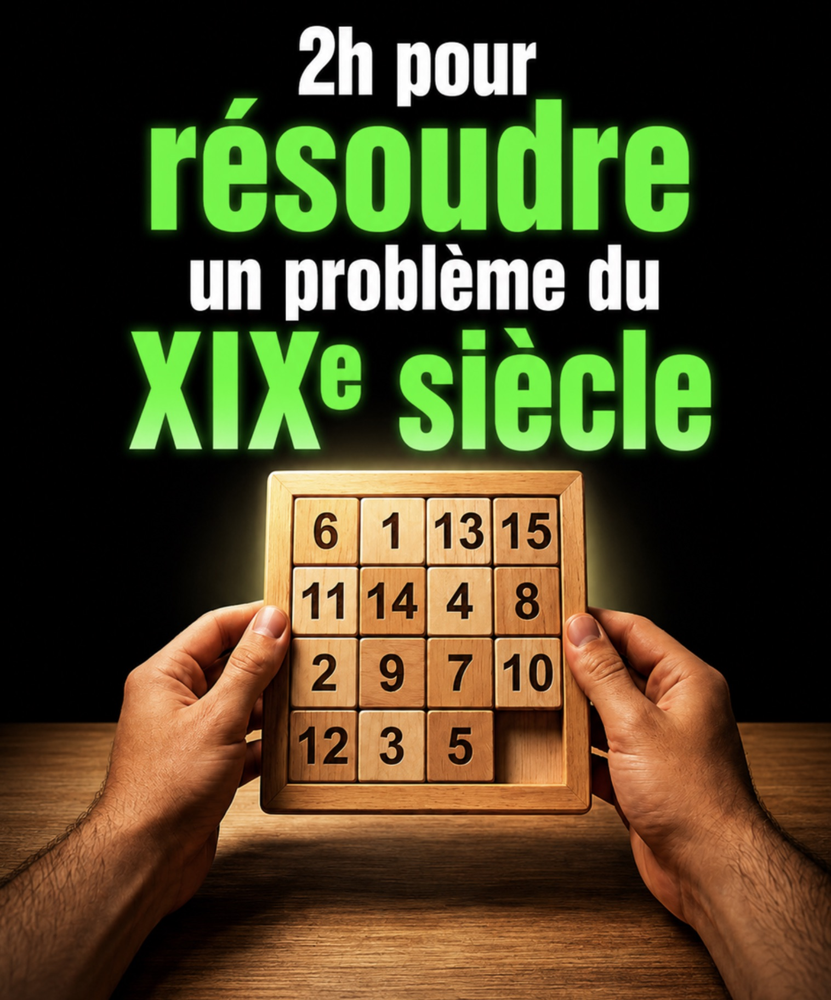
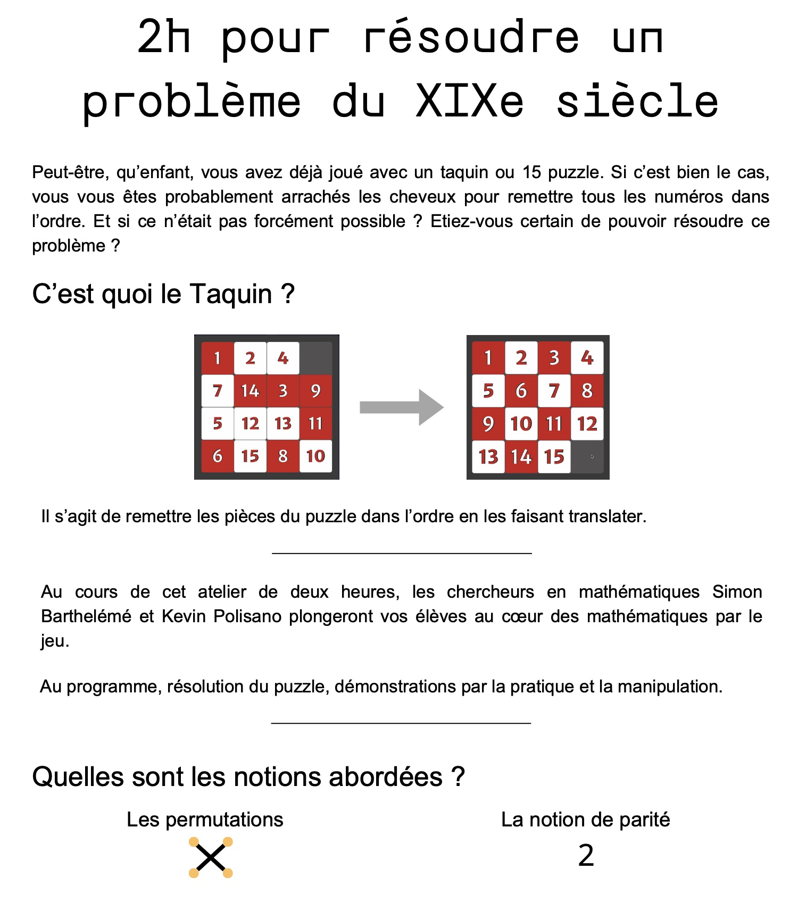
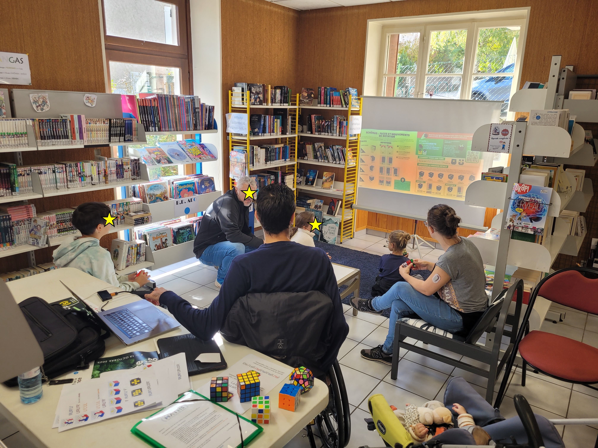
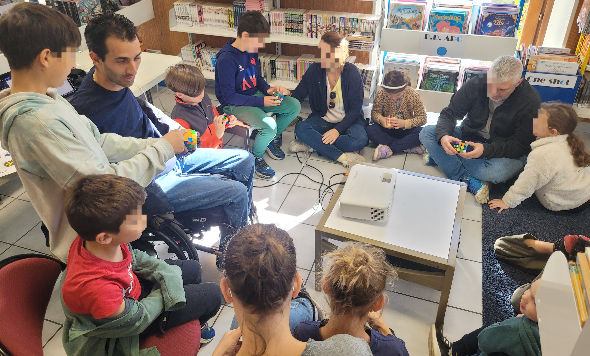
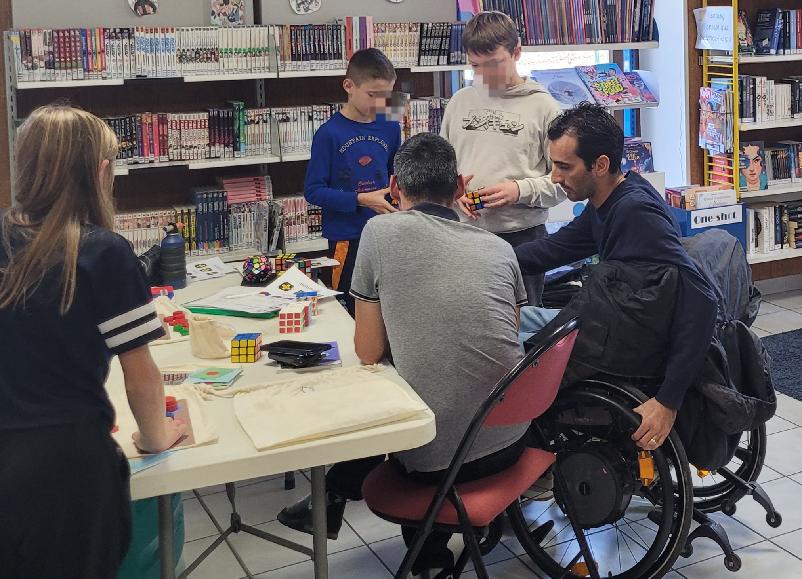

## Articles 

### Sur mon blog

- [Quand interrompre un jeu devient un problème mathématique](https://www.kevinpolisano.fr/posts/2026-03-30-le-probleme-des-partis/), 20 mars 2026.
- [Le jeu de taquin](https://www.kevinpolisano.fr/posts/2025-10-27-le-jeu-de-taquin/), 27 octobre 2025.
- [Résoudre le Rubik’s cube](https://www.kevinpolisano.fr/posts/2025-07-07-les-mathematiques-du-rubik-cube/), 7 juillet 2025.

### Dans la presse

- [Quand interrompre un jeu devient un problème mathématique](https://www.echosciences-grenoble.fr/articles/quand-interrompre-un-jeu-devient-un-probleme-mathematiques), *Echosciences Grenoble*, 2 avril 2026.
- [Entretien avec Emmanuel Candès](https://kevinpolisano.github.io/pdf-storage/Doctorat/candes-interview.pdf), *Remise du prix Jean Kuntzmann*, 16 juin 2014.

## Vidéos

::: {style="position: relative; padding-bottom: 56.25%; height: 0; overflow: hidden; max-width: 100%; text-align: center;"}
<iframe src="https://www.youtube.com/embed/0QWGoQTRXho?si=aEEjOBwbDmgQIG2l" title="YouTube video player" frameborder="0" allow="accelerometer; autoplay; clipboard-write; encrypted-media; gyroscope; picture-in-picture; web-share" allowfullscreen style="position: absolute; top: 0; left: 50%; transform: translateX(-50%); width: 100%; height: 100%;">

</iframe>
:::

## Présentations

- [Introduction à l’intelligence artificielle](https://polisano.pages.math.cnrs.fr/slides/2024-11-21-intro-ia/intro-ia.html#/title-slide). Une brève excursion dans le monde du machine learning, 1 décembre 2024. 

::: {style="position: relative; padding-bottom: 56.25%; height: 0; overflow: hidden; max-width: 100%; text-align: center;"}
<iframe src="https://polisano.pages.math.cnrs.fr/slides/2024-11-21-intro-ia/intro-ia.html" title="YouTube video player" frameborder="0" allow="accelerometer; autoplay; clipboard-write; encrypted-media; gyroscope; picture-in-picture; web-share" allowfullscreen style="position: absolute; top: 0; left: 50%; transform: translateX(-50%); width: 100%; height: 100%;">

</iframe>
:::

## Ateliers

### Le jeu de taquin : démontrer l'impossible !

### Percer les mystères mathématiques du Rubik's cube

Atelier durant lequel j'apprends aux jeunes (et aux moins jeunes) à résoudre le Rubik's cube, puis à découvrir certaines propriétés mathématiques de ce fabuleux cube.

::: {layout-ncol="3"}
{width="33%" group="my-gallery"}

{width="33%" group="my-gallery"}

{width="33%" group="my-gallery"}
:::